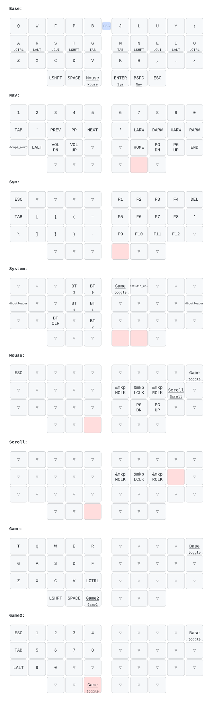

# Crosses ZMK config

Firmware for my GGGW Crosses/Bridges 36-key wireless split (SuperMini nRF52840,
trackball on the right half, no displays). The layout is a straight port of my
Charybdis nano keymap ([ojfw20/charybdis](https://github.com/ojfw20/charybdis)):
Colemak-DH with home-row mods, tri-layer nav/sym, explicit mouse and scroll
layers, and two game layers. Based on the official
[crosses-zmk](https://github.com/Good-Great-Grand-Wonderful/crosses-zmk) template.

Firmware builds in GitHub Actions on every push. Flash order for a fresh pair:
`settings_reset` on both halves, then `crosses_36_left` / `crosses_36_right`
(use the `_internal_osc` variants if Bluetooth is unstable on the SuperMinis).

Tuning knobs live in `config/crosses.keymap`: trackball CPI via
`&trackball_central { cpi = <...>; };`, scroll speed/direction in the
`scroller` input-processor node.

